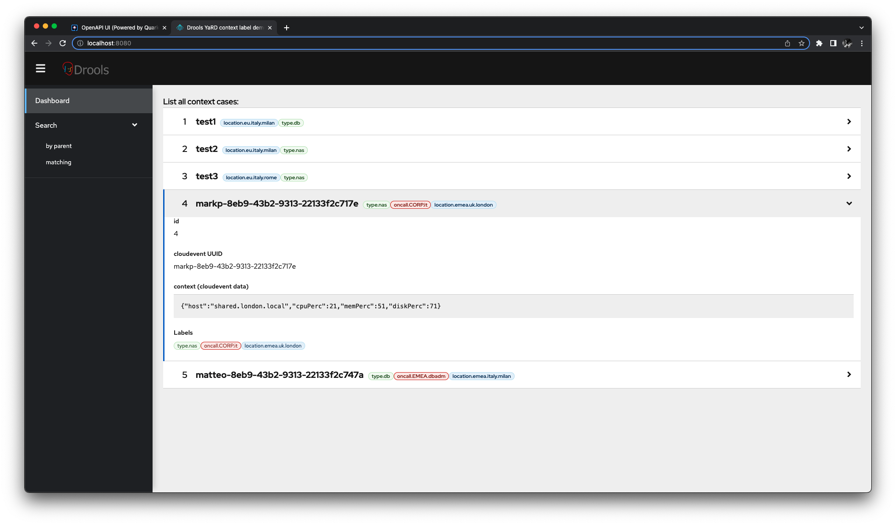
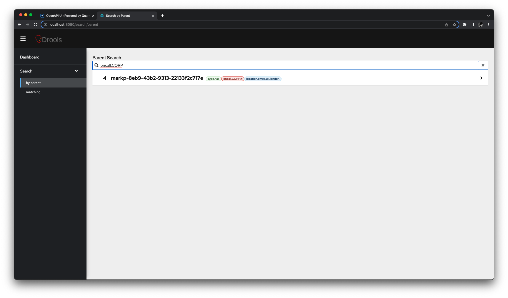
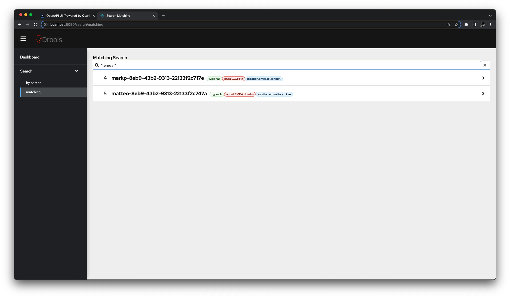

# demo20220715contextlabel Project

Technologies used in this demo: [Drools](https://www.drools.org/learn/video.html), [YaRD](https://github.com/kiegroup/yard/), [Kogito](https://kogito.kie.org/), [Quarkus](https://quarkus.io/), [cloudevents](https://cloudevents.io/), [hibernate-types](https://github.com/vladmihalcea/hibernate-types#readme), [quarkus-quinoa](https://quarkiverse.github.io/quarkiverse-docs/quarkus-quinoa/dev/), [PatternFly](https://www.patternfly.org/v4/).

Goals:
 - Demo a Classification of cloudevent generic context based on YaRD rule definition with ad-hoc indexed searching of association of _hierarchical_ labels via PostgreSQL's `ltree` for any given context

Non goals:
 - Not yet wired Kafka
 - Fully implemented GUI (focusing on backend, and for the frontend [chabuduo](https://youtube.com/clip/UgkxeVe0fr81gBBZXzQ1LG2189Z1QrYspmXt) MVP working-PoC 🚀)

## Requirements

- openjdk 17
- Apache Maven 3.8.6
- Docker
- NodeJS v18.6.0

## Overview

A cloudevent is submitted to this application, for example:

```json
{
  "specversion": "1.0",
  "id": "matteo-8eb9-43b2-9313-22133f2c747a",
  "source": "example",
  "type": "demo20220715contextlabel.demotype",
  "data": {
    "host": "basedidati.milano.local",
    "diskPerc": 70,
    "memPerc": 50,
    "cpuPerc": 20
  }
}
```

For once a demo not involving Loan or Insurances ;) The data context of the cloud event pertains to some host which came under supervision due to resource load.
We now want to classify this context/case, using some labels.
We may have more than 1 label.
Each label is hierarchical (`root.branch1.branch2.leaf`).

Ultimately, we might want to setup a labeling rule for who's on call, something ~like a Kie Drools YaRD rule definition of a decision table:

```yaml
    type: DecisionTable
    inputs: ['.location', '.type']
    rules:
    - when: ['startswith("location.emea")', '. == "type.db"']
      then: '"oncall.EMEA.dbadm"'
    - when: ['startswith("location.emea") | not', '. == "type.db"']
      then: '"oncall.CORP.dbadm"'
    - when: ['true', '. == "type.nas"']
      then: '"oncall.CORP.it"'
```

For example, a cloudevent context may be labeled as follows:
 - `type.db`
 - `location.emea.italy.milan`
 - `oncall.EMEA.dbadm`

For the PostgreSQL DDL we currently have:
```
                       Table "public.cecase"
 Column  |          Type          | Collation | Nullable | Default 
---------+------------------------+-----------+----------+---------
 id      | bigint                 |           | not null | 
 ceuuid  | character varying(255) |           |          | 
 context | jsonb                  |           |          | 
 mytag   | ltree[]                |           |          | 
Indexes:
    "cecase_pkey" PRIMARY KEY, btree (id)
    "mytag_gist_idx" gist (mytag)
    "mytag_idx" btree (mytag)
```

Please notice taking advantage of PostgreSQL's `jsonb` for storing the original cloudevent context, and `ltree[]` for searching ad-hoc indexed the hiearachical labels.

This is extremely helpful to setup queries making use of `<@` and `~` operator for PostgreSQL which performs on `ltree`, showcased below.

As the data flows to the application, we can use this provisional GUI which uses the backend REST API(s) made on Quarkus:



In the screenshot above, you can access all the records from the table, where the labels have been applied by the rule definition.

We can browse by, having at least one label having the specified parent with a query like
```sql
SELECT * FROM cecase WHERE mytag <@ 'oncall.CORP'
```

for example if we want all the records having at least a label for the `oncall.CORP` rooting:



We can browse by, having at least one label having the specified `ltree` query like
```sql
SELECT * FROM cecase WHERE mytag ~ `*.emea.*`
```

for example if we want all the records having at least a label for the `*.emea.*` (a branch named `emea` in any point in the hieararchical label):



## dev notes

```
docker ps
docker exec -it <id> sh
psql -U hibernate default
\d
```

```
default=# SELECT * FROM cecase WHERE mytag ~ '*.eu.*';
 id | ceuuid |          context           |               mytag               
----+--------+----------------------------+-----------------------------------
  1 | test1  | {"host": "milan.archivio"} | {location.eu.italy.milan,type.db}
(1 row)

default=# SELECT * FROM cecase WHERE mytag <@ 'location.eu';
 id | ceuuid |          context           |               mytag               
----+--------+----------------------------+-----------------------------------
  1 | test1  | {"host": "milan.archivio"} | {location.eu.italy.milan,type.db}
(1 row)
```

<!--

This project uses Quarkus, the Supersonic Subatomic Java Framework.

If you want to learn more about Quarkus, please visit its website: https://quarkus.io/ .

## Running the application in dev mode

You can run your application in dev mode that enables live coding using:
```shell script
./mvnw compile quarkus:dev
```

> **_NOTE:_**  Quarkus now ships with a Dev UI, which is available in dev mode only at http://localhost:8080/q/dev/.

## Packaging and running the application

The application can be packaged using:
```shell script
./mvnw package
```
It produces the `quarkus-run.jar` file in the `target/quarkus-app/` directory.
Be aware that it’s not an _über-jar_ as the dependencies are copied into the `target/quarkus-app/lib/` directory.

The application is now runnable using `java -jar target/quarkus-app/quarkus-run.jar`.

If you want to build an _über-jar_, execute the following command:
```shell script
./mvnw package -Dquarkus.package.type=uber-jar
```

The application, packaged as an _über-jar_, is now runnable using `java -jar target/*-runner.jar`.

## Creating a native executable

You can create a native executable using: 
```shell script
./mvnw package -Pnative
```

Or, if you don't have GraalVM installed, you can run the native executable build in a container using: 
```shell script
./mvnw package -Pnative -Dquarkus.native.container-build=true
```

You can then execute your native executable with: `./target/demo20220715contextlabel-1.0.0-SNAPSHOT-runner`

If you want to learn more about building native executables, please consult https://quarkus.io/guides/maven-tooling.

## Related Guides

- SmallRye OpenAPI ([guide](https://quarkus.io/guides/openapi-swaggerui)): Document your REST APIs with OpenAPI - comes with Swagger UI
- Hibernate ORM with Panache ([guide](https://quarkus.io/guides/hibernate-orm-panache)): Simplify your persistence code for Hibernate ORM via the active record or the repository pattern

## Provided Code

### RESTEasy JAX-RS

Easily start your RESTful Web Services

[Related guide section...](https://quarkus.io/guides/getting-started#the-jax-rs-resources)

-->